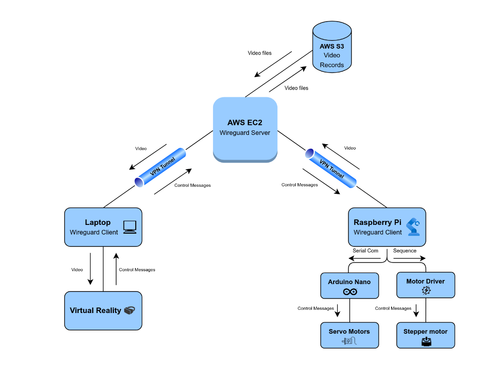

# Телехирургия - дистанционно управление на хирургични операции

Телехирургията е иновативно решение, което позволява дистанционно записване и управление на хирургични операции от всяка точка на света, осигурявайки висока сигурност и минимално закъснение на комуникацията.

<!--  -->


## Архитектура



## Структура на проекта

```bash
.
├── client-doctor          # Клиент, който се стартира на компютъра на хирурга
├── client-robot           # Клиент, който управлява робота и изпраща видео
├── infrastructure         # Terraform за изграждане на инфраструктура в AWS
└── wireguard              # Конфигурация на WireGuard VPN сървър
```

## Основни компоненти

### Клиент на лекаря (`client-doctor`)

- Получава видео в реално време от робота.
- Предава видеото за визуализация към VR устройство, което осигурява прецизно управление и поглед върху хирургичната среда.

### Клиент на робота (`client-robot`)

- Получава команди от VR устройството.
- Управлява мултифункционална универсална поставка за медицински инструменти.
- Изпраща видео поток от интегрирана камера.

### Инфраструктура (`infrastructure`)

- Изградена с Terraform.
- Хостната на Amazon Web Services (AWS).

### VPN комуникация (`wireguard`)

- Използва WireGuard VPN протокол за максимална сигурност и скорост.
- Всички комуникации са криптирани и защитени.

### Визуализация

- Python Flask Socket.IO сървър за изпращане и получаване на видео в реално време.
- A-frame за 3D визуализация, съвместима с VR устройства.

## Използвани технологии

- **Terraform** за автоматизиране на инфраструктурата
- **AWS** за хостване на услугите
- **WireGuard VPN** за сигурна комуникация
- **Python Flask Socket.IO** за управление на видеопотоци
- **A-frame** за интерактивна VR визуализация
